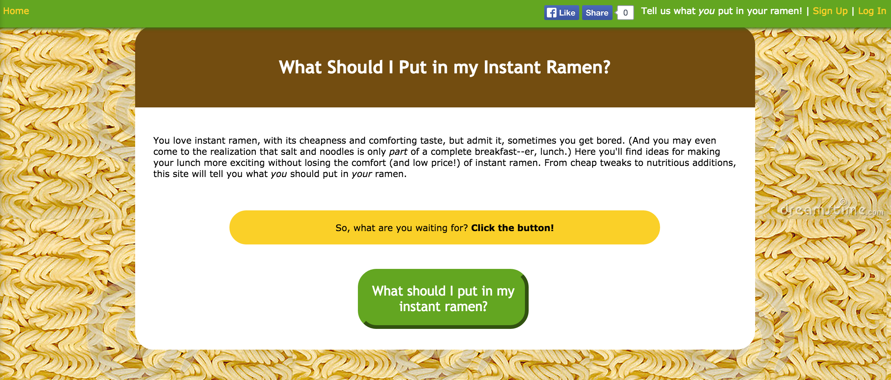
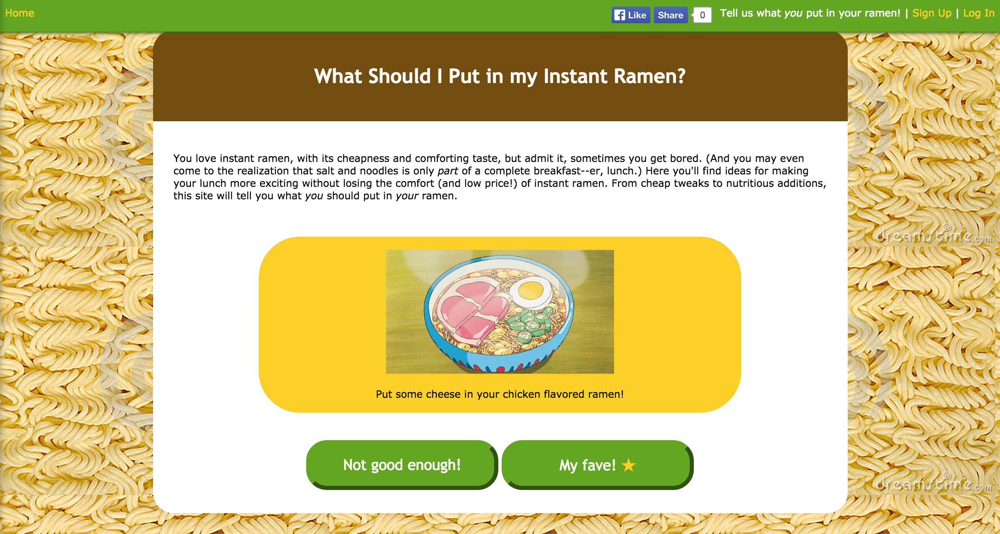
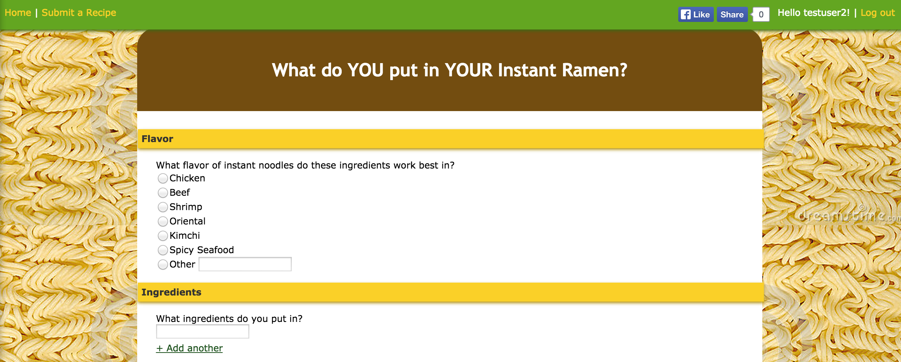
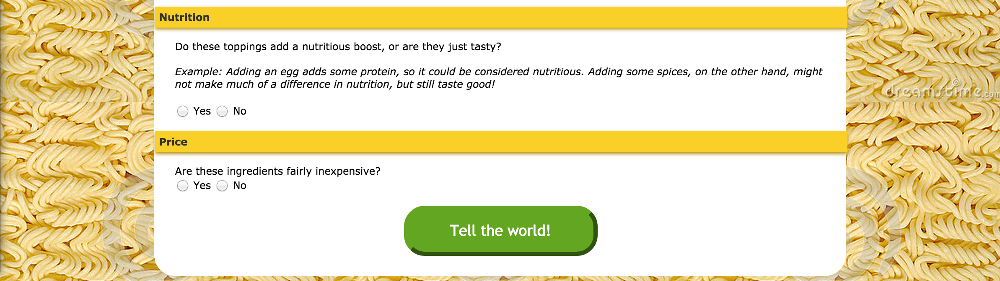
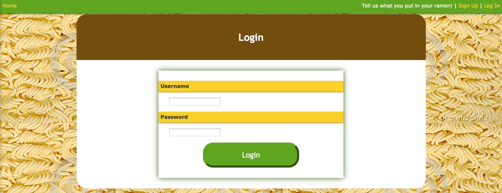

# RamenGen
*Ramen recipe generator*

RamenGen is a website for users to share their instant ramen recipes and discover new ones. It started out as a PHP and MySQL-based class project at OSU where the requirements were:

* Have at least 2 tables in a MySQL database
* Use sessions to keep users logged in
* Use AJAX
* Use both client-side and server-side validation
* Keep passwords secure with a hash

I ended up going beyond the project requirements and having a lot of fun with it. I added REST operations (for the users and recipes) and a random recipe generator. I'm working on transferring the project over to a new PHP server, but for now, here are screenshots and the code itself.

## Screenshots

